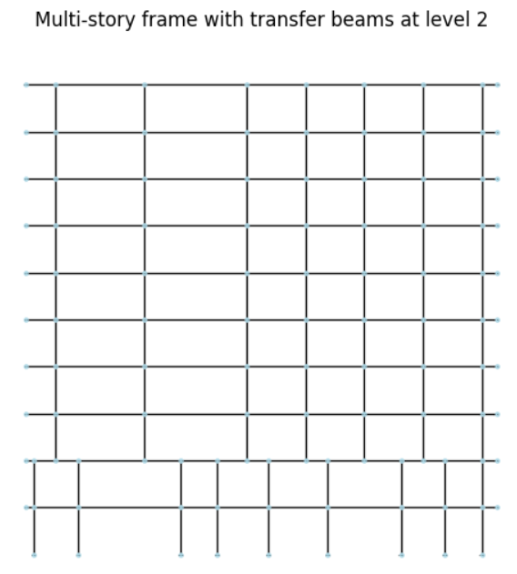

# GNN Model Intuitions

This document provides a detailed discussion of the Graph Neural Network surrogate model used in this project: the data representation, feature engineering, message passing mechanism, model architecture, and directions for improvement.

---

## Understanding the Data

Each frame structure is naturally represented as a graph: joints are nodes and beams/columns are edges.

<br>
A typical sample contains 132 nodes and 207 edges (columns + beams). Each node carries coordinates (`coo`), a position (`pos`), and a degree of freedom (`DOF`). Each edge has features indicating whether it is a column or a beam, its depth, width, and the nodes/joints it connects. The graph is undirected — an element connecting node i to j is the same as j to i. Point loads can be represented as attributes of nodes, and distributed loads as attributes of edges.

Any frame structure, under any load, can be represented as a graph. In this framework, our goal is to predict a dependent attribute (deflection validity) of edges given the independent attributes of the nodes and edges (geometry, size, material, and force).

### Why individual-edge prediction is insufficient

Using what we know from supervised learning, we could fit a classification function that, for each edge, takes the attributes of that edge alongside the attributes of its two endpoint nodes and predicts whether the deflection stays below the regulated threshold. However, the behavior of each element is **not independent** of other elements in the structure. We cannot partition the stiffness matrix into blocks where each block represents the stiffness of one element independently. Frame structures are connected graphs, and the structural response is global.

Therefore, our surrogate model needs to take the attributes of **all** edges and nodes as input. If a structure has 20 nodes and 100 elements (each node with 3 attributes, each element with 2 attributes), we need a function from $\mathbb{R}^{20 \times 3 + 100 \times 2}$ to $\mathbb{R}^{100}$. Change the structure to 101 elements, and this function becomes useless — the input dimension has changed. We would need millions of separate surrogate models, one per configuration. Furthermore, the function must be **permutation invariant**: feeding nodes in a different order describes the same structure and should produce the same predictions. These challenges make a naive supervised learning approach infeasible.

---

## Line Graph Transformation

Edge-level GNN tasks are generally harder than node-level tasks. A common trick is to convert the structure into its **line graph**, where the original edges become nodes and two nodes in the line graph are connected if the corresponding original edges share an endpoint.

Before this transformation, all node attributes are embedded into their adjacent edges. For example, if a column is connected to a fixed support, an attribute `foundation=1` is added to that edge. The relative positions of each edge's endpoints (with respect to the bottom-left corner of the structure) are also stored as edge attributes. After embedding all necessary node information into edges, the graph is converted to its line graph representation, turning our edge-level prediction task into a node-level prediction task.

---

## Feature Engineering

Certain features are crucial for estimating structural behavior under load:

- **Element length (`dist`):** Long spans (over 10 meters in residential buildings) tend to experience large deflections and are generally avoided.
- **Transfer beam flag (`transfer`):** Transfer beams distribute the load of upper columns to lower levels and typically need greater depth.
- **Cantilever flag (`cant`):** Whether the beam is a cantilever.
- **Level and position (`level`, `level_ratio`, `col_l2r_ratio`):** The relative vertical and horizontal position of the element in the building.
- **Cross-section properties:** Instead of raw depth and width, we use $DW$ (cross-sectional area) and $D^3W$ (proportional to the second moment of area for rectangular sections), which are more physically meaningful for frame analysis.

### Example edge attributes

Looking at a single edge from a sample graph:

| Attribute | Value | Description |
|---|---|---|
| `D` | 0.414 | Depth (normalized) |
| `W` | 0.588 | Width (normalized) |
| `column` | False | Whether this is a column |
| `foundation` | False | Whether connected to a fixed support |
| `dist` | 0.25 | Element length (m) |
| `cant` | True | Cantilever beam |
| `transfer` | False | Transfer beam |
| `level` | 1.0 | Floor level |
| `level_ratio` | -0.125 | Relative vertical position |
| `col_l2r_ratio` | 0.0077 | Relative horizontal position |
| `step_size` | 0.05 | FEA mesh resolution (m) |
| `real` | True | Whether this is a physical edge (vs. artificial) |
| `valid` | True | Ground truth label |
| `normal_deflection` | 3.44e-06 | Actual normal deflection |
| `drift` | 0 | Actual lateral drift |

The `deflection` array holds the full displacement profile along the element (used for visualization, not as model input). The `valid` flag is the prediction target.

---

## Message Passing

Graph neural networks use **message passing** to let each node aggregate information from its neighbors. This is crucial because element behavior depends on surrounding elements.

The core assumption is that **elements connected by a few steps are more likely to affect each other**, while distant elements are relatively independent. Each message passing step propagates information one hop further. With $k$ steps, each node's representation encodes information from its $k$-hop neighborhood.

Using GNNs, we fit the same function on each node (element in the line graph) to predict its stability, but allow each node to incorporate aggregated information from its close neighbors via message passing.

### The `real` attribute

The `real` attribute distinguishes physical structural elements from non-physical graph nodes. When a **virtual node** is used (the `with_vn` edge strategy), it is marked with `real=False` so the model can distinguish it from real elements. All physical edges have `real=True`.

---

## Model Architecture: SharedMPNN

The model is intentionally minimal:

```
SharedMPNN(
  (conv0): Linear(13 -> 18)       # Project 13 input features to hidden dim
  (conv1): GraphConv(18, 18)       # Single shared message passing layer
  (fc2):   Linear(18 -> 1)         # Output logit per node
)
```

1. **Linear projection** — maps the 13 input features to `hidden_dim` (18).
2. **Shared GraphConv** — a single `GraphConv` layer applied `num_message_passing_steps` (3) times with **the same weights** each time.
3. **Linear readout** — maps hidden representations to 1 logit per node (element), passed through sigmoid for binary classification.

The total parameter count is roughly 700. Training uses `BCEWithLogitsLoss` with class-rebalancing `pos_weight` to handle the imbalance between valid (majority) and invalid elements.

### Weight sharing via repeated convolution

Reusing the same convolution layer across multiple message passing steps is a well-established technique, not a novel one. It is essentially the same idea behind:

- **Recurrent message passing** in Message Passing Neural Networks (Gilmer et al., 2017)
- **Deep Equilibrium Models** (Bai et al., 2019)
- The original GNN formulation by Scarselli et al. (2009), which explicitly iterated a shared function to a fixed point

With only 100 training samples, a model with separate parameters per layer would overfit immediately. Sharing weights across message passing steps is a form of **regularization** that also increases the effective **receptive field** — each step propagates information one hop further, so 3 steps gives each node access to its 3-hop neighborhood.

For a 14-story structure, 3 hops on the line graph covers a reasonable local neighborhood. To capture longer-range dependencies, the model relies on either the **virtual node** (which puts every element within 2 hops of every other) or **Laplacian positional encodings** (which encode each element's position in the global graph topology).

### Comparison: SharedMPNN vs. fully connected baseline

The notebook also includes a simple `FC` (fully connected) baseline that ignores graph structure entirely. The FC model applies the same MLP independently to each node — it has no message passing and therefore no way to capture inter-element dependencies. The GNN's advantage comes entirely from its ability to aggregate neighborhood information.

---

## Why Not Domain-Knowledge Edges?

An earlier version of this project included **hop edges** — hand-crafted artificial edges connecting transfer-row nodes to upper-floor column nodes to encode load path relationships. These were removed for three reasons:

1. **No performance benefit:** With Laplacian positional encoding, hop edges performed no better (and slightly worse) than the plain line graph or the virtual node approach.
2. **Not generalizable:** For arbitrary geometries, load paths cannot be manually identified. In a general surrogate model, this knowledge should be learned, not hand-crafted.
3. **Dataset expansion requires expert input:** Adding new structure families would require an expert to redesign the hop edge logic each time, making the approach impractical to scale.

The virtual node and GPS Graph Transformer both provide long-range communication without any domain-specific edge engineering.

---

## Approaches for Long-Range Dependencies

Frame structures require long-range communication: elements far apart in the graph can be closely related through shared load paths. This project implements three approaches, each avoiding hand-crafted domain edges:

### 1. Virtual Node (simplest)

Add a single virtual node connected to all real nodes. This gives every node a 2-hop path to every other node. It is a one-line change in PyG and works well with small datasets. No domain knowledge is needed. Used via `--edge_strategy with_vn`.

### 2. Laplacian Positional Encodings

Instead of altering the graph topology, encode structural properties as additional node features. Laplacian eigenvectors capture global graph structure and relative node positions, telling the model about each element's position within the load-path topology. This is always included as part of the feature set (k=8 spectral coordinates).

### 3. GPS Graph Transformer

Graph Transformers use **self-attention** as an all-to-all message passing mechanism. Every node can attend to every other node, so the model can learn which distant nodes matter. The GPS architecture (Rampasek et al., 2022) combines local GINConv layers with global transformer attention, getting the best of both worlds. Used via `--model gps --edge_strategy no_vn`.

### Comparison Summary

| Approach | Pros | Cons |
|---|---|---|
| SharedMPNN + virtual node | Tiny model, works with 100 samples, best-calibrated predictions | Less expressive than attention |
| SharedMPNN + no edges | Simplest graph, no artificial nodes | Relies entirely on positional encodings for long-range |
| GPS Graph Transformer | Learns long-range interactions, highest AUC on out-of-distribution test sets | More parameters; prone to overfitting — higher test loss despite lower validation loss |

---

## Summary

The SharedMPNN architecture is a sound choice for this constrained problem: weight sharing prevents overfitting on a small dataset, and repeated message passing extends the receptive field. Long-range dependencies are handled through the virtual node, Laplacian positional encodings, or the GPS Graph Transformer — all of which avoid hand-crafted domain edges and generalize to new structure families without expert redesign.

With variable loads (sampled from distributions rather than fixed values), SharedMPNN with virtual node produces the best-calibrated predictions (lowest test loss) while GPS achieves slightly higher AUC but significantly higher test loss — evidence that its extra parameters overfit the training distribution. The weight-sharing constraint in SharedMPNN acts as a strong regularizer that becomes increasingly valuable when the input distribution is broadened by load variation.
