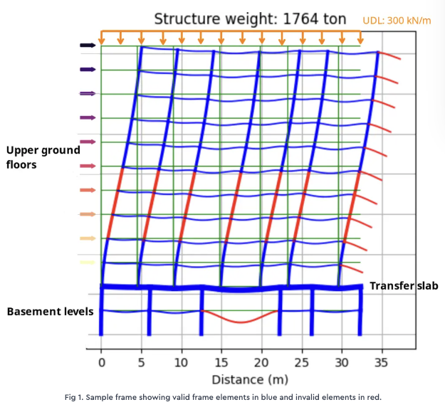

# 2D Frame GNN Surrogate



A pip-installable Python package for generating, analysing, and learning from 2D multi-story reinforced concrete frame structures.

---

## Problem Statement

Assume we want to assess the stability of a frame structure under the following conditions:

**Stability Criteria:**
- Lateral drift: $H/500$
- Vertical deflection: $L/2000$

**Modulus of Elasticity (MOE):**
- 32800 MPa

**Load:**
- Lateral Load: Point load on each level representing wind load from left to right, increasing with height.
- Vertical Load: SDL, uniform (300 KN/m)

In the above image, beams and columns that do not meet the stability criteria are colored red (invalid elements). The blue elements are considered valid. A structure is valid if and only if all its elements are valid (i.e., the deflection of beams and drift of columns are within the specified thresholds).

## Stability Criteria

An element is labelled **valid** (`y=1`) if it satisfies:

- **Beam vertical deflection:** normalised deflection < L / 2000, where L is the span length
- **Column lateral drift:** inter-storey drift < H / 500, where H is the storey height

A structure is considered valid only if **all** of its elements are valid.

---

## Key aspects of this problem:

1. **Validation Threshold:** We predict whether deformation stays within code-specified limits (not the exact value), since structural engineers care about pass/fail, not precise magnitudes.

2. **Multiple Loads:** The structure is subjected to both vertical (SDL) and lateral (wind) loads simultaneously.

3. **Scoped Generalization:** A fully general surrogate for arbitrary frame geometries is intractable — it would require billions of samples. Instead, we focus on a specific family: grid-layout RC frames with basement levels and above-ground residential levels, where the basement column layout may differ from the upper levels (requiring transfer beams). The training set is drawn from multiple building configurations (`dataset_1` through `dataset_6` in `config.json`) to cover a range of widths, heights, and column layouts.

---

## GNN Architecture — The Core Innovation

> **The GNN model and its graph data representation are the central contribution of this project.**

Predicting structural validity is not a standard supervised learning problem. Because frame structures are connected systems, the deflection of any element depends on the stiffness and loading of the *entire* structure — not just its own cross-section. This rules out per-element classifiers. Three key design decisions make the surrogate tractable:

### 1. Line Graph Transformation

Frame structures are naturally edge-centric: beams and columns are edges, joints are nodes. Edge-level GNN prediction is harder than node-level prediction, so each structure is converted to its **line graph** — original edges become nodes, and two line-graph nodes are connected if the corresponding elements share a joint. This turns element-validity prediction into standard node classification.

Before the transformation, all joint information (support conditions, relative position) is embedded into adjacent edge features so no structural information is lost.

### 2. Physically Motivated Feature Engineering

Raw cross-section dimensions are replaced by features grounded in structural mechanics:

| Feature | Physical meaning |
|---|---|
| **DW** | Proportional to cross-sectional area (axial stiffness) |
| **D³W** | Proportional to second moment of area (bending stiffness) |
| **Transfer beam flag** | Identifies elements carrying redistributed column loads |
| **Cantilever flag** | Flags elements with a free end (high deflection risk) |
| **Level & position ratios** | Encode location in the load path |
| **Load projections** | Axial and transverse load components at each endpoint, projected along the element axis — encode the force environment |
| **Laplacian PE (k=8)** | Spectral coordinates from the normalized graph Laplacian — encode each element's position within the load-path topology |

Each node in the line graph has 25 features (17 structural + 8 Laplacian positional encoding). Feature names and normalization targets are defined in `graph_utils.py` as `FEATURE_NAMES`, `NORM_COLUMN_FEATURES`, `NORM_BEAM_FEATURES`, and `NORM_LOAD_FEATURES`.

### 3. Shared-Weight Message Passing (SharedMPNN)

A single `GraphConv` layer is applied repeatedly for `mp_steps` iterations with **tied weights**. This forces the model to learn one general message-passing rule rather than separate per-layer transformations — a strong inductive bias that matches the structural regularity of frame buildings.

### 4. GPS Graph Transformer (GPSModel)

An alternative architecture based on the **General, Powerful, Scalable (GPS)** Graph Transformer (Rampasek et al., NeurIPS 2022). Each GPS layer runs a local `GINConv` and a global multi-head self-attention in parallel, then combines their outputs:

- **Local branch:** `GINConv` aggregates information from graph neighbors (same local inductive bias as SharedMPNN)
- **Global branch:** multi-head self-attention attends over all nodes simultaneously — every element can directly attend to every other element, regardless of topological distance

This eliminates the need for artificial edges (e.g. virtual node) to propagate long-range structural dependencies. The model is trained on the `no_vn` edge strategy (plain line graph, no added edges).

Select the GPS architecture with `--model gps` when training.

---

### Read more

**[→ GNN Model Intuitions](GNN_model_intuitions.md)** — a detailed walkthrough of the data representation, line graph construction, feature derivations, message passing mechanics, and directions for improvement. This is the primary technical reference for the model.

---

## Installation

Requires Python >= 3.9.

```bash
python -m venv .venv
source .venv/bin/activate

pip install torch
pip install torch_geometric
pip install -e .
```

`huggingface_hub` is included as a dependency and installed automatically. To upload datasets or models to Hugging Face, set the `HF_TOKEN` environment variable:

```bash
export HF_TOKEN=your_token_here
```

---

## Quick Start

### 1. Generate data

```bash
# Training data (2000 structures from 5 configs) — saved locally
python scripts/generate_dataset.py --datasets dataset_1 dataset_3 dataset_4 dataset_5 dataset_6 \
    --num_samples 2000 --mode train --concurrency 8

# Test data (from a held-out config)
python scripts/generate_dataset.py --datasets dataset_2 --num_samples 200 --mode test --concurrency 4
```

Each run:
- Generates structures by sampling from the specified dataset configs, runs FEA, and saves raw NetworkX line graphs to `data/{mode}/base/` (the **base dataset** — topology + attributes, no feature extraction)
- Extracts PyG features and saves two edge-strategy variants (`with_vn`, `no_vn`) from the same structures

Pass `--hf_repo ehsan94/fea-gnn-surrogate` to upload the generated `.pkl` files to Hugging Face (requires `HF_TOKEN`).

**Changing features without re-running FEA:** If you modify feature extraction (e.g. add or remove a feature), you can re-extract from the saved base data without regenerating structures or re-running FEA:

```bash
python scripts/extract_features.py --mode train
python scripts/extract_features.py --mode test
```

### 2. Train

```bash
# SharedMPNN (default)
python scripts/train_surrogate.py --model mpnn --edge_strategy with_vn --epochs 50 --run_eval

# GPS Graph Transformer — no artificial edges needed
python scripts/train_surrogate.py --model gps --edge_strategy no_vn --epochs 20 \
    --hidden_dim 18 --mp_steps 3 --dropout 0.5 --run_eval
```

Training data is loaded from Hugging Face by default (`hf://ehsan94/fea-gnn-surrogate`). To use a local directory instead, pass `--data_dir data`.

The best model is saved to `best_model_<model>_<edge_strategy>.pth`. Pass `--hf_repo ehsan94/fea-gnn-surrogate` to upload to Hugging Face (requires `HF_TOKEN`). The `--run_eval` flag evaluates on the pooled test set after training.

### 3. Evaluate on test sets

```bash
python scripts/evaluate_model.py --model_path best_model_mpnn_with_vn.pth \
    --test_sets test
```

Test data is loaded from Hugging Face by default. Both `--model_path` and `--data_dir` accept `hf://owner/repo` paths:

```bash
python scripts/evaluate_model.py \
    --model_path hf://ehsan94/fea-gnn-surrogate/best_model_mpnn_with_vn.pth \
    --test_sets test
```

Output:

```
Model:  best_model_mpnn_with_vn.pth
Test Set              Loss       AUC
----------------------------------------
  test                0.0491    0.9839
```

### 4. Inference — rank structures

```bash
python scripts/run_inference.py --data_dir data/test
```

This loads the model matching the edge strategy (default: `best_model_mpnn_with_vn.pth`), ranks test structures by predicted validity, runs FEA on the top candidates, and saves deflection plots.

---

## Configuration

`config.json` defines the building geometry for each dataset configuration. It contains six dataset sections (`dataset_1` through `dataset_6`), each representing a different building family with distinct grid widths, storey ranges, and column layouts. During generation, the `--datasets` flag selects which configs to sample from and `--mode` determines whether data is saved as `train` or `test`.

Each section has these fields:

| Field | Meaning |
|---|---|
| `num_cols` | Grid width (number of column positions) |
| `num_rows_dist` | Distribution over number of storeys (sampled per structure) |
| `transfer_row_dist` | Distribution over transfer slab position |
| `horizontal_scale` | Bay width in metres per grid unit |
| `vertical_scale` | Storey height in metres |
| `possible_columns_up` | Candidate column positions above the transfer slab |
| `possible_columns_down` | Candidate column positions below the transfer slab |
| `distance_lower_bound` | Minimum allowable column spacing (metres) |
| `distance_upper_bound` | Maximum allowable span (metres) |
| `load` | Load distribution parameters (vertical/horizontal means and standard deviations) |

---

## CLI Reference

See [CLI_REFERENCE.md](CLI_REFERENCE.md) for the full argument reference for all scripts.

---

## Edge Strategy Comparison

Each generation run produces two graph representations of the **same** structures:

| Variant | Description |
|---|---|
| **`with_vn`** | Global shared virtual node connected to all elements — every element is exactly 2 hops from every other |
| **`no_vn`** | No artificial edges; pure local message passing (baseline) |

### Experimental results (25 features, Laplacian PE k=8, variable load, 2000 training samples)

Training uses variable loads: vertical and horizontal forces are sampled from distributions (see `load` section in `config.json`) rather than fixed values. The training set is drawn from 5 dataset configs (`dataset_1`, `dataset_3`–`dataset_6`) covering a range of building widths and heights. The test set uses a held-out config (`dataset_2`) with a different column layout.

#### SharedMPNN

| Variant | Test AUC | Test Loss | Val Loss |
|---|---|---|---|
| No edges (baseline) | 0.9740 | 0.0583 | 0.0531 |
| Virtual node | **0.9839** | **0.0491** | **0.0424** |

The virtual node variant achieves the best overall test AUC (0.9839) and lowest test loss (0.0491). With load features included, the model benefits from both Laplacian positional encoding and the virtual node's 2-hop shortcut for long-range communication.

#### GPS Graph Transformer

| Variant | Test AUC | Test Loss | Val Loss |
|---|---|---|---|
| GPS (no edges) | 0.9797 | 0.0514 | 0.0363 |

GPS is trained on the plain line graph (`no_vn`) — no virtual node needed. Global self-attention replaces all hand-crafted long-range connections. GPS achieves competitive AUC (0.9797) and the lowest validation loss (0.0363), but its test loss is slightly higher than SharedMPNN with virtual node. This gap between validation and test performance suggests the attention mechanism still overfits slightly compared to SharedMPNN's weight-sharing constraint.

---

## Project Structure

```
fea-gnn-surrogate/
├── pyproject.toml                        # pip package definition
├── config.json                           # geometry configs for train + test sets
│
├── src/fea_gnn_surrogate/               # main package
│   ├── config.py                         # load_config(): parse config.json
│   ├── generate.py                       # generate_samples(): full generation pipeline
│   ├── visualization.py                  # plot_structure(), plot_deflection()
│   ├── fea/
│   │   ├── geometry.py                   # member_rotation, calc_rotation_length
│   │   ├── stiffness.py                  # build_K, calculate_Kg, calc_DOF
│   │   ├── nodal_reactions.py            # calc_displacement, assemble_UG
│   │   ├── member_reactions.py           # transform_U_to_local, deflection diagrams
│   │   └── environment.py               # StructEnvironment: analyse(), set_attributes()
│   ├── graph/
│   │   └── graph_utils.py               # GraphHandler: generate, simplify, PyG serialisation
│   └── surrogate/
│       ├── model.py                      # SharedMPNN, GPSModel, FC model definitions
│       ├── dataset.py                    # load_dataset, create_dataloaders, normalisation
│       ├── train.py                      # training loop with TensorBoard logging
│       └── inference.py                  # load_model, predict, rank_structures
│
├── scripts/
│   ├── generate_dataset.py               # CLI: generate samples + save base NX graphs + PyG graphs
│   ├── extract_features.py               # CLI: re-extract PyG features from base NX graphs (no FEA)
│   ├── train_surrogate.py                # CLI: train the GNN
│   ├── evaluate_model.py                 # CLI: report test set metrics
│   └── run_inference.py                  # CLI: rank test structures by GNN predictions
│
└── tests/
    └── __init__.py
```

---

## Related Resources

The following tutorials are published on [Engineering Skills](https://www.engineeringskills.com). Readers who are new to machine learning are encouraged to go through them in the order listed below, as each one builds on the concepts introduced in the previous.

1. [Machine Learning in Civil Engineering: Sensitivity Analysis](https://www.engineeringskills.com/posts/members/machine-learning-in-civil-engineering-sensitivity-analysis) — A gentle introduction to optimisation methods in civil engineering, with a focus on the adjoint method for sensitivity analysis. A good starting point if you are new to the topic.

2. [Machine Learning in Civil Engineering: Surrogate Models](https://www.engineeringskills.com/posts/members/machine-learning-in-civil-engineering-surrogate-models) — Introduces the concept of surrogate modelling: replacing expensive simulations with lightweight learned functions. Covers supervised learning fundamentals, regression, and classification through a truss deflection example.

3. [Advanced Surrogate Models with Graph Neural Networks](https://www.engineeringskills.com/posts/members/advanced-surrogate-models-with-graph-neural-networks) — A comprehensive companion tutorial to this project. Covers the full pipeline in depth: graph representation of frame structures, line graph transformation, feature engineering, GNN message passing, model training, and evaluation with detailed analysis and visualisations.
